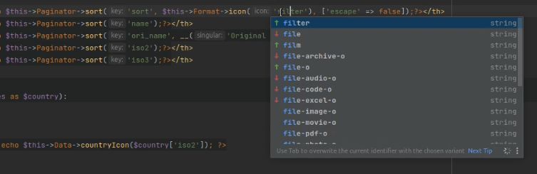

## CakePHP IdeHelper Extras

IDE auto-complete for your custom code elements.

### Existing tasks
Follow the main documentation on how to add them.

#### Tools.FormatHelper::icon()



Fontawesome v4/v5/v6:
- FormatIconFontAwesome4Task
- FormatIconFontAwesome5Task
- FormatIconFontAwesome6Task

Pick one depending on the FA version you are using.

For bootstrap icons:
- FormatIconBootstrapTask

#### Tools.IconHelper::render()

Uses the configured task sets:
- IconRenderTask

#### Authentication.AuthenticationService::loadIdentifier()

- AuthServiceLoadIdentifierTask

To enable, add it to the task stack in your app config:
```php
use IdeHelperExtra\Authentication\Generator\Task\AuthServiceLoadIdentifierTask;

...

'IdeHelper' => [
    'generatorTasks' => [
        AuthServiceLoadIdentifierTask::class => AuthServiceLoadIdentifierTask::class,
    ],
],
```

### Add your own task

The idea of this repository is to provide a way to collect useful tasks and addons where adding them into the main
plugin is not feasable. Always first check, and then add it here.

The downside of adding it here is a missing constraint towards your plugin version, and that it can lead
to accidental BC breaks.

#### Contributing guidelines
If you want to add your Task here for example:
- src/[PluginName]/[Type]/Task/[ClassNameDetails]Task.php
- test case along with it
- test should also have smoke test of the functionality if possible (to be alerted about BC breaks)
- PR with green checks

You are accepting to be responsible to keep the API of your specific plugin intact.
Fails/Regressions should be handled by you if possible.

A TravisCI cronjob on the repo will check daily status here.
